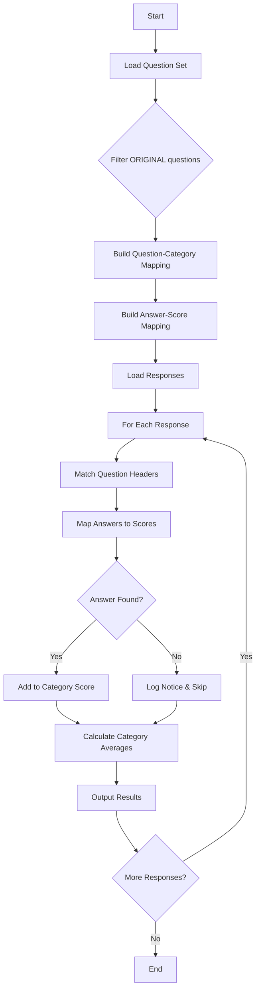

# PEMM Assessment Scoring Script Implementation Plan

## Overview
This document outlines the implementation plan for a Python script that scores self-assessment questionnaire responses from Google Forms. The scoring system maps text answers to maturity levels (1-4) and calculates average scores by category.

## Requirements
- Process questionnaire responses from CSV files
- Map text answers to numeric maturity scores (L1=1, L2=2, L3=3, L4=4)
- Group scores by category
- Output timestamp and average score for each category
- Handle unmatched answers by skipping and logging
- Skip questions marked as "(ORIGINAL)"
- Handle empty question rows gracefully

## Data Files
- **Question Set**: `sample_data/Question-set.csv`
  - Contains categories, questions, and answer options for each maturity level (L1-L4)
- **Responses**: `sample_data/respones.csv`
  - Contains timestamps and text answers for each question

## Implementation Architecture

### Core Components

```python
# scoring.py structure

import csv
import logging
from collections import defaultdict
from typing import Dict, List, Tuple

class AssessmentScorer:
    def __init__(self, questions_file: str, responses_file: str):
        self.questions_file = questions_file
        self.responses_file = responses_file
        self.question_map = {}
        self.category_map = {}
        
    def load_questions(self) -> Dict:
        """Load questions and build mappings"""
        
    def load_responses(self) -> List[Dict]:
        """Load response data"""
        
    def find_maturity_level(self, answer: str, maturity_options: Dict) -> int:
        """Match answer text to maturity level"""
        
    def score_response(self, response: Dict) -> Dict[str, float]:
        """Calculate scores for a single response"""
        
    def process_all_responses(self):
        """Main processing loop"""
```

### Processing Flow



## Key Processing Rules

1. **Question Filtering**:
   - Skip rows containing "(ORIGINAL)" in the question text
   - Include rows with empty questions but skip them during scoring if no answer provided
   - Build a mapping of question text to category and maturity level answers

2. **Answer Matching**:
   - Use case-insensitive exact string matching
   - Strip whitespace from both questions and answers
   - If no match is found, log a notice and skip the question (don't include in average)

3. **Score Calculation**:
   - L1 answer = score of 1
   - L2 answer = score of 2  
   - L3 answer = score of 3
   - L4 answer = score of 4
   - Calculate average score per category (sum of scores / number of answered questions)

4. **Output Format**:
   ```
   Timestamp: 5/27/2025 11:46:07
   Investment: 2.75
   Adoption: 2.67
   Interfaces: 2.50
   Operations: 4.00
   Measurement: 2.25
   ```

## Error Handling

- Log notices for:
  - Unmatched answers (answer text doesn't match any L1-L4 option)
  - Questions in responses that aren't in the question set
  - Empty categories (no valid scores)
- Continue processing despite errors
- Provide summary at end showing:
  - Total responses processed
  - Number of unmatched answers
  - Any other issues encountered

## Usage

```bash
python scoring.py
```

The script will:
1. Read question set from `sample_data/Question-set.csv`
2. Read responses from `sample_data/respones.csv`
3. Process and score each response
4. Output results to console

## Future Enhancements (not in initial version)
- Command-line arguments for input/output files
- CSV output option for easier data analysis
- Fuzzy matching for answer text
- Visualization of maturity scores
- Batch processing of multiple response files
- Configuration file for custom scoring rules
- Web interface for uploading and processing files